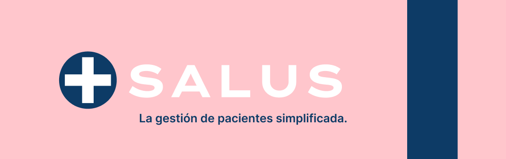
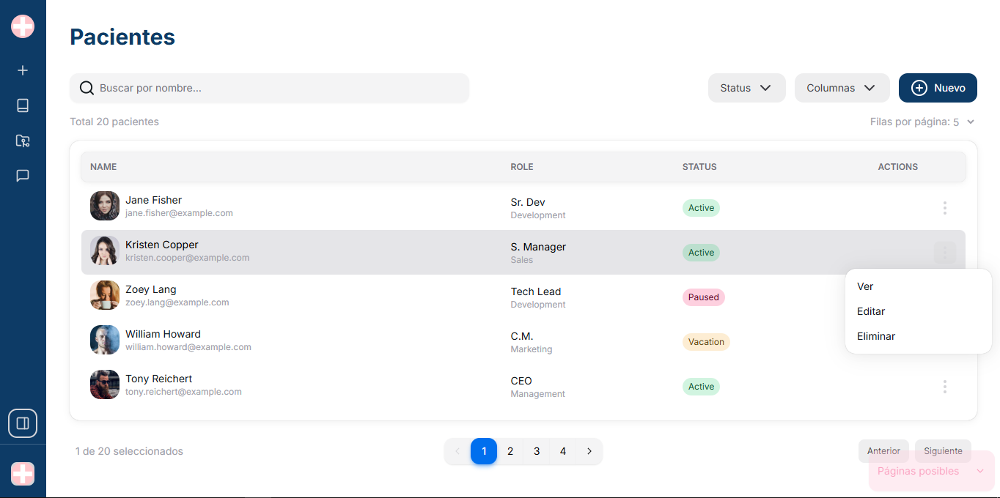

  

<h3 align="center">Equipo <strong>c22-25-ft-webapp</strong> 🐐</h3>

_**Salus**_ es una plataforma orientada a [[entidades médicas]], diseñada para administrar a sus profesionales, pacientes y consultas médicas; todo en el mismo lugar. Accesible desde cualquier celular móvil, computadora o aparato electrónico.

## 📝 **Características**

- **👁‍🗨 Gestionar consultas médicas:** Como [[entidad médica]] podrás observar todas las consultas que ocurren en tu [[entidad médica]],
- **🏆 Gestionar pacientes:** Como profesional podrás administrar tus consultas médicas, revisar el historial médico de tus pacientes [[algo más acá]]
- **🎀 MÁS:** lorem ipsum

## 🎥 **Video explicativo**

Explora las principales funcionalidades de <em>Salus</em> en este vídeo:  

## 👩🏻‍💻 **Prueba la aplicación en vivo**

¡Descubre <em>Salus</em> en este momento!  

## 🖼️ **Imágenes**

<figure>
  
  <figcaption>Página de pacientes <strong>(PlaceholderImage - Cambiar)</strong></figcaption>
</figure>

## 🔨 **Tecnologías**

### Diseño UX/UI

### Backend

[![Java][Java]][Java-url]
[![SpringBoot][SpringBoot]][SpringBoot-url]
[![PostgreSQL][PostgreSQL]][PostgreSQL-url]

### Frontend

[![Next.js][Next.js]][Next-url]
[![React.js][React.js]][React-url]
[![TailwindCSS][TailwindCSS]][TailwindCSS-url]
[![NextUI][NextUI]][NextUI-url]
[![ReactHookForm][ReactHookForm]][ReactHookForm-url]
[![ESLint][ESLint]][ESLint-url]
[![Prettier][Prettier]][Prettier-url]

<!-- [![Axios][Axios]][Axios-url] -->
<!-- [![Zustand][Zustand]][Zustand-url] -->

 

  
Equipo

  

<h2 align="center">🛡️ <strong>Integrantes del equipo</strong> ⚔️</h2>

<table style="margin: auto; text-align: center;">
  <tr>
    <td></td>
    <td></td>
    <td></td>
    <td></td>
  </tr>
  <tr>
    <td><strong>Eduardo R.</strong></td>
    <td><strong>María C.</strong></td>
    <td><strong>Franco A.</strong></td>
    <td><strong>Cynthia S.</strong></td>
  </tr>
  <tr>
    <td>Front-End</td>
    <td>UX/UI</td>
    <td>Back-End</td>
    <td>Team Leader</td>
  </tr>
  <tr>
    <td style="text-align: center;">
       
      
    </td>
    <td style="text-align: center;">
       
      
    </td>
    <td style="text-align: center;">
       
      
    </td>
    <td style="text-align: center;">
       
      
    </td>
  </tr>
  <tr>
    <td></td>
    <td></td>
    <td></td>
  </tr>
  <tr>
    <td><strong>Walter M.</strong></td>
    <td><strong>Fernando V.</strong></td>
    <td><strong>Juan I.</strong></td>
  </tr>
  <tr>
    <td>Back-End</td>
    <td>Back-End</td>
    <td></td>
  </tr>
  <tr>
    <td style="text-align: center;">
       
      
    </td>
    <td style="text-align: center;">
       
      
    </td>
    <td style="text-align: center;">
       
      
    </td>
  </tr>
</table>
  

  

<!--  -->
<!--     -->
<!--        -->
<!-- MARKDOWN LINKS-->

<!-- Front-End - Skills -->

[Next.js]: https://img.shields.io/badge/next.js-000000?style=for-the-badge&logo=nextdotjs&logoColor=white
[Next-url]: https://nextjs.org/
[React.js]: https://img.shields.io/badge/React-20232A?style=for-the-badge&logo=react&logoColor=61DAFB
[React-url]: https://reactjs.org/
[Zustand]: https://img.shields.io/badge/Zustand-005570?style=for-the-badge&logo=zustand&logoColor=white
[Zustand-url]: https://zustand-demo.pmnd.rs/
[Axios]: https://img.shields.io/badge/Axios-5A29E4?style=for-the-badge&logo=axios&logoColor=white
[Axios-url]: https://axios-http.com/
[TailwindCSS]: https://img.shields.io/badge/TailwindCSS-06b6d4?style=for-the-badge&logo=tailwind-css&logoColor=white
[TailwindCSS-url]: https://tailwindcss.com/
[NextUI]: https://img.shields.io/badge/NextUI-000000?style=for-the-badge&logo=nextui&logoColor=white
[NextUI-url]: https://nextui.org/
[ReactHookForm]: https://img.shields.io/badge/reacthookform-ec5990?style=for-the-badge&logo=reacthookform&logoColor=white
[ReactHookForm-url]: https://www.react-hook-form.com/
[ESLint]: https://img.shields.io/badge/eslint-4b32c3?style=for-the-badge&logo=eslint&logoColor=white
[ESLint-url]: https://eslint.org/
[Prettier]: https://img.shields.io/badge/prettier-f7b93e?style=for-the-badge&logo=prettier&logoColor=white
[Prettier-url]: https://prettier.io/

<!-- Back-End - Skills -->

[Java]: https://img.shields.io/badge/Java-ED8B00?style=for-the-badge&logo=Java&logoColor=white
[Java-url]: https://www.java.com/es/
[SpringBoot]: https://img.shields.io/badge/SpringBoot-6DB33F?style=for-the-badge&logo=SpringBoot&logoColor=white
[SpringBoot-url]: https://spring.io/projects/spring-boot
[PostgreSQL]: https://img.shields.io/badge/PostgreSQL-4169e1?style=for-the-badge&logo=PostgreSQL&logoColor=white
[PostgreSQL-url]: https://spring.io/projects/spring-boot
